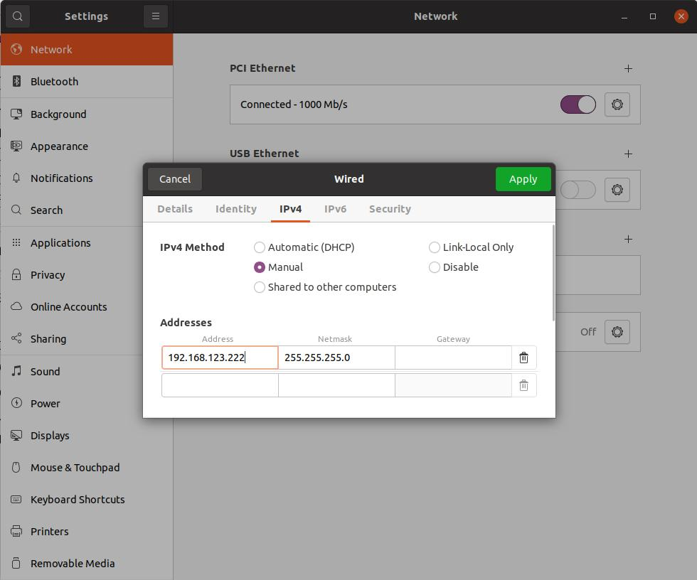

# unitree-retarget

Retarget [mocap data](https://huggingface.co/datasets/unitreerobotics/LAFAN1_Retargeting_Dataset) to Unitree G1

## Installation

Install `unitree_sdk2py`:
```
virtualenv -p /usr/bin/python venv-unitree
. venv-unitree/bin/activate

git clone https://github.com/unitreerobotics/unitree_sdk2_python.git
cd unitree_sdk2_python
pip3 install -e .
cd -

git clone https://github.com/LambdaLabsML/unitree-retarget.git
cd unitree-retarget
```

## Usage

__Step 1__: Turn on `G1` and put it into debug mode
Make sure `G1` is secured on the harness. Then follow the "Development and debugging video" on [this page](https://support.unitree.com/home/en/G1_developer/quick_start) to put it under the debug mode (on your remote controller, do `R2+L2` then `L2+A`)


__Step 2__: Connect your computer to unitree robot

You can directly connect them using a CAT6 cable, or connect both of them to a router. In both cases, make sure manually set IPv4 address to `192.168.123.222` with mask `255.255.255.0`. This is because `G1` has static a IP `192.168.123.164`, and DHCP won't automatically put your computer under the same subnet.




As a sanity check, you should be able to:
* Ping `G1` with `ping 192.168.123.164`
* ssh into it with `ssh unitree@192.168.123.164` and password `123`

__Step 3__: Sanity Check

`python run_check.py`


__Step 4__: Retarget Demo

`python run_retarget.py --mocap_file ./data/g1/dance2_subject1.csv`


